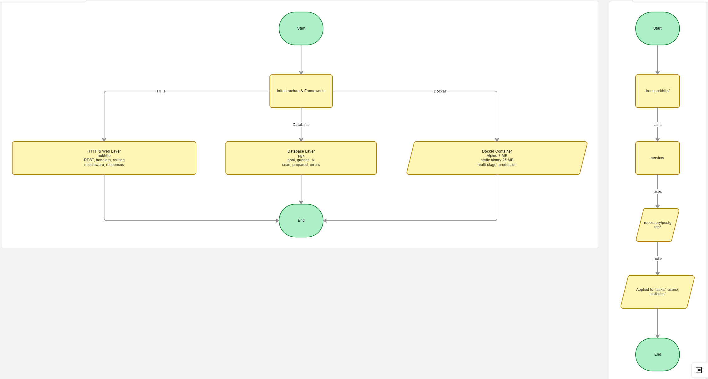

```
┌────────────────────────────────────────────────┐
│     🌐 OUTER LAYER: Infrastructure             │
│  ┌──────────────────────────────────────────┐  │
│  │ • HTTP Transport (REST API)              │  │
│  │ • PostgreSQL Repository Adapter          │  │
│  │ • Docker Container Runtime               │  │
│  │ • Middleware & Request Routing           │  │
│  └──────────────────────────────────────────┘  │
│  ┌──────────────────────────────────────────┐  │
│  │    🔄 MIDDLE LAYER: Use Cases             │  │
│  │  ┌────────────────────────────────────┐  │  │
│  │  │ • Task Service (CRUD operations)   │  │  │
│  │  │ • User Service (Management)        │  │  │
│  │  │ • Statistics Service (Analytics)   │  │  │
│  │  │ • Business Logic & Validations     │  │  │
│  │  └────────────────────────────────────┘  │  │
│  │  ┌──────────────────────────────────────┐ │  │
│  │  │   🎯 CENTER: Domain Entities        │ │  │
│  │  │  • User Model (business rules)      │ │  │
│  │  │  • Task Model (pure logic)          │ │  │
│  │  │  • Statistics Model (no deps)       │ │  │
│  │  │  • Nullable & Validation types      │ │  │
│  │  └──────────────────────────────────────┘ │  │
└────────────────────────────────────────────────┘
```

**Key Principle**: Dependencies point inward. The core domain knows nothing about HTTP, databases, or frameworks.

---

## 📁 Project Structure (Clean Go Convention)

```
GO_DOCKER_TODO_API/
│
├── 📦 cmd/                          [Application Entry Points]
│   └── todoapp/
│       ├── main.go                  [Server bootstrap]
│       ├── Dockerfile               [Multi-stage build]
│       └── exe                       [Compiled binary]
│
├── 🔐 internal/                     [Private Application Code - Not importable by other modules]
│   │
│   ├── core/                        [Infrastructure & Configuration]
│   │   ├── config/                  [App configuration loading]
│   │   ├── domain/                  [Core types & domain models]
│   │   ├── errors/                  [Error definitions]
│   │   ├── logger/                  [Structured logging]
│   │   └── repository/              [Database adapters & pooling]
│   │
│   └── features/                    [Business domain features - Three-layer pattern]
│       │
│       ├── tasks/                   [Task Management Feature]
│       │   ├── repository/          [Database queries for tasks]
│       │   │   └── postgres/
│       │   ├── service/             [Task business logic]
│       │   │   ├── create_task.go
│       │   │   ├── delete_task.go
│       │   │   ├── get_task.go
│       │   │   ├── get_tasks.go
│       │   │   ├── patch_task.go
│       │   │   └── service.go
│       │   └── transport/http/      [REST endpoints]
│       │       ├── create_task.go
│       │       ├── delete_task.go
│       │       ├── get_task.go
│       │       ├── get_tasks.go
│       │       ├── patch_task.go
│       │       └── transport.go
│       │
│       ├── users/                   [User Management Feature]
│       │   ├── repository/          [User database operations]
│       │   ├── service/             [User business logic]
│       │   └── transport/http/      [User REST endpoints]
│       │
│       └── statistics/              [Statistics & Analytics]
│           ├── repository/          [Query aggregations]
│           ├── service/             [Stats calculations]
│           └── transport/http/      [Stats endpoints]
│
├── 📊 migrations/                   [Database Schema Evolution]
│   ├── 000001_init.up.sql           [Initial schema creation]
│   └── 000001_init.down.sql         [Rollback logic]
│
├── 🐳 docker-compose.yml            [Local development environment]
├── 📝 go.mod & go.sum               [Dependency management]
├── 🔧 Makefile                      [Common commands (env-up, migrate-up, run)]
└── 📖 Readme.md                     [Project documentation]
```

## Local Run
make env-up
make migrate-up
make env-port-forward
make todoapp-run


## Go Questions to look into.

Context, usage with RESPONSE/Request
Channels, Goroutine.

Middlewares.
Layers of API.
Mux.

Gracefull shutdown, Tracing(RequestID),


# Deploy
### docker logs todoapp-env-app(Container name) will show our logs

## Buy Server
### Choose Ubuntu
### Server name : todo-test-server
### Generate SSH Key for server to have remote control
  * Add your Public SSH KEY
### Server will give you static IP address, that can be accessed from the web
### Connect to the server with SSH.
 * `mkdir projects`
 * `git clone your_project`
 * [Install Git] - `apt update && apt upgrade`
 * [choose] - Keep the local version currently installed configuration
 * `apt install git`
 * Git Clone (If repo is private, add the server through new SSH key to your repo)
 * `cd repo`
 * create .env file [`cp .env.exampel .env`] -> `vim .env` (`apt install vim ` if needed) -> fill ENV_VARS
 * Install DOCKER [Google it for Ubuntu]
 * `make env-up`
 * `make migrate-up`
 * `make todoapp-deploy`
 * Now check {PUBLIC_IP}/api/v1/tasks

 ### Memory issues with docker
  * Add swap file,
  ```
    fallocate -l 2G /swapfile
    chmod 600 /swapfile
    mkswap /swapfile
    swapon /swapfile

    apt install htop
    htop [Check that SWP=2Gb]
  ```